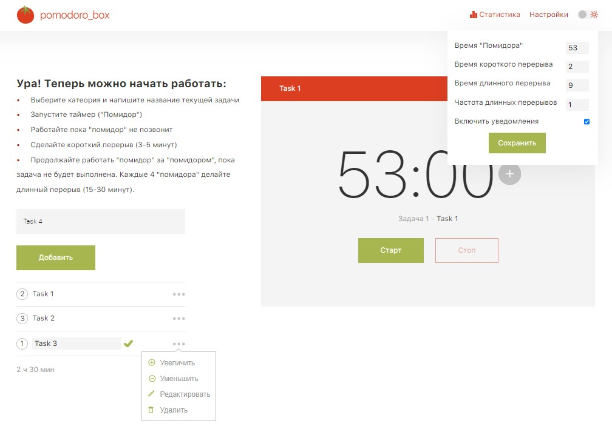
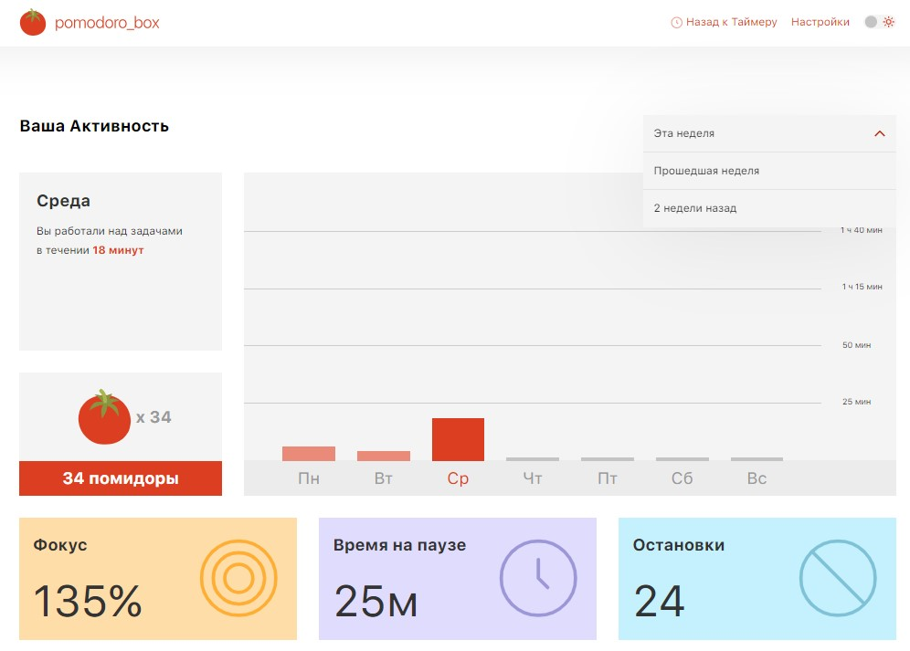

# Pomodoro timer(React приложение)

### Описание проекта

_Метод «Помодоро» — это техника управления временем, разработанная студентом
колледжа Франческо Чирилло в 1980-х годах. В основе техники, названной от
итальянского слова «помидор», лежат многочисленные временные интервалы,
распределённые в течение дня и обозначенные на кухонном таймере в форме помидора,
который Чирилло использовал сам, когда оттачивал свой метод управления временем._

- __Основная страница__ с таймером:
    - Шапка с логотипом, ссылкой на страницу со статистикой, настройками таймера и переключнием на светлую/темную тему оформления страницы
    - Инструкция по работе с приложением
    - Форма для добавления задачи
    - Список задач с возможностью редактирования(добавить,  редактировать, удалить, добавить "помидор")
    - Таймер с кнопками управления(старт, стоп, пауза, продолжить, пропустить)

- __Страница со статистикой__ использования таймера:
    - Шапка с логотипом, ссылкой на страницу со таймером, настройками таймера и переключнием на светлую/темную тему оформления страницы
    - Столбчатая диаграмма времени использвания таймера по дням недели
    - Выбор недели
    - Дополнительные метрики по использованию метода(количество остановок, время на паузе, время в "фокусе")
      

Макет в Figma - [ссылка](https://www.figma.com/file/E6fg8YJUsz0kunP9Q3zF8o/Pomodoro-(Copy)?type=design&node-id=0-1&mode=design&t=fMEb5VQWVf9NElB3-0)

### Используемый стек

- React
- TypeScript
- Redux
- React-Router-DOM

_Проект собран с использованием готового стартера CreateReactApp_

### Установка, запуск

- склонировать репозиторий командой

> git clone ...

или

> git pull ...
 
- установить зависимости в папке проекта

> npm install

- запустить сборку в режиме разработки:

> npm start

или в режиме продакшена:

> npm run build

_в режиме "продакшена" после сборки необходимо запустить сервер командами:_
> npm install -g serve
> serve -s build

